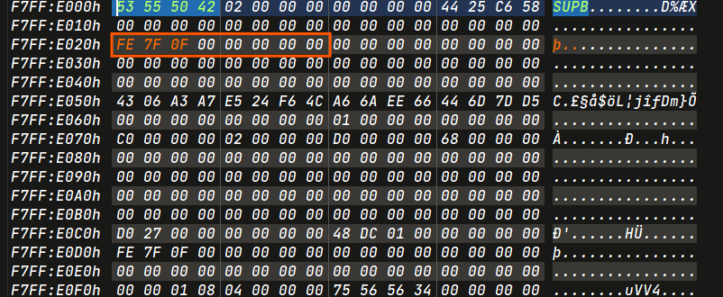
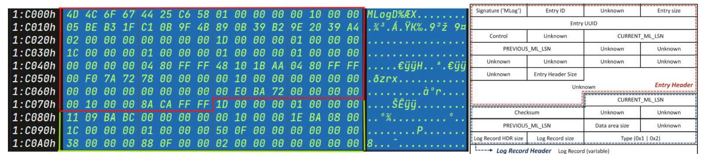
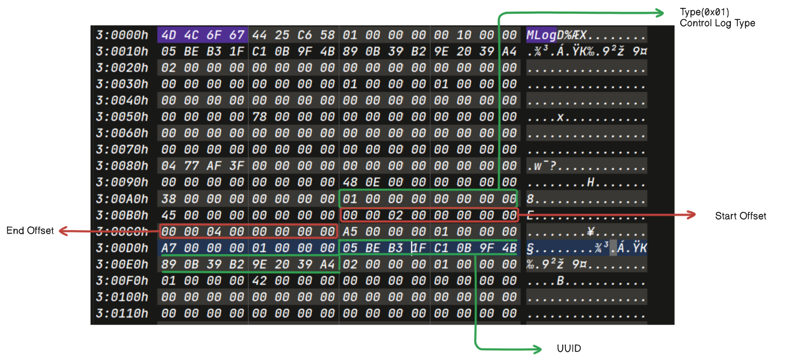
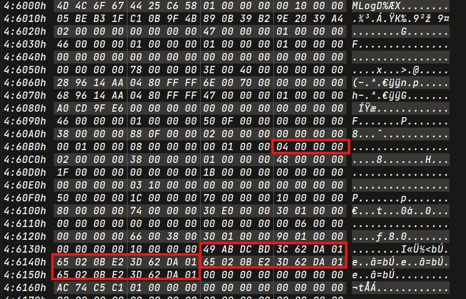
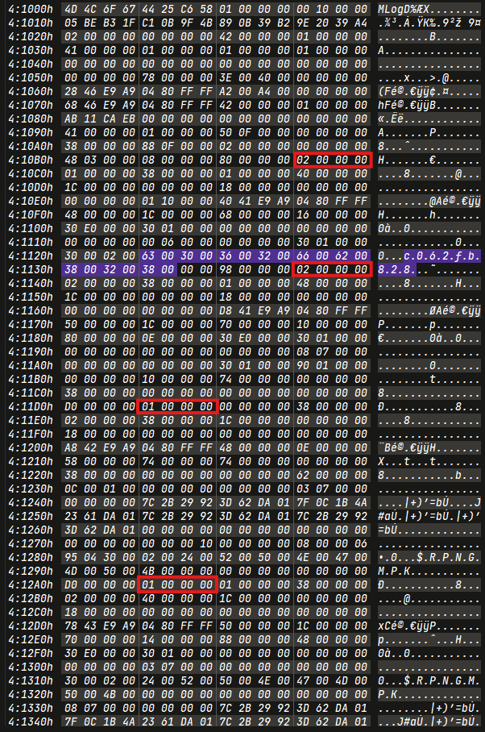
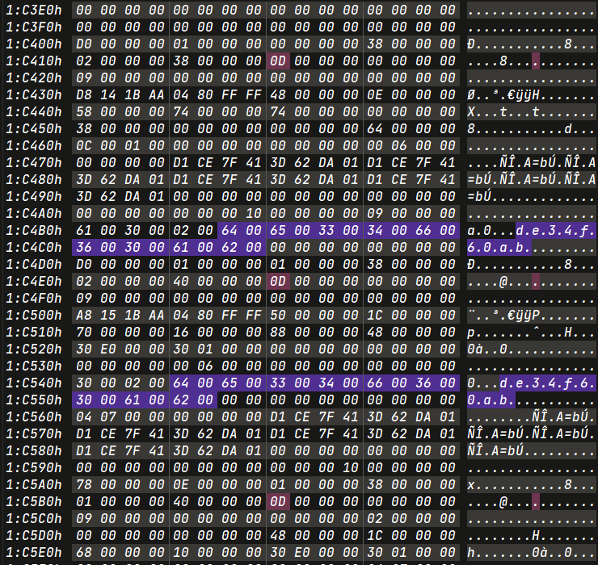
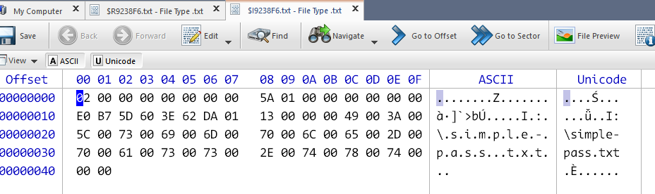
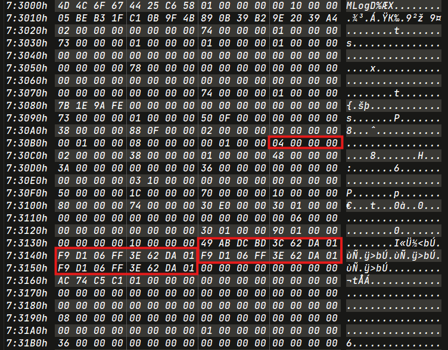
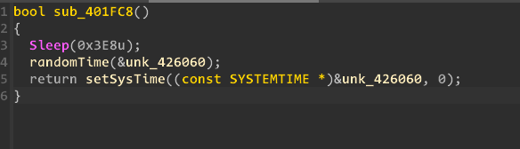

Full detailed writeup for ReAL-File-System which is centered around ReFS Log Analysis.

**tl;dr**

+ Disk Forensics 
+ Resilient File System
+ Log Analysis 

<!--more-->

**Challenge Points**: 1000
**No. of solves**: 0
**Challenge Author**: [5h4rrK](https://twitter.com/5h4rrK)


### Challenge Description
In a desperate bid to synchronize my PC clock, I unwittingly downloaded an application that promised a quick fix but instead wrought havoc by encrypting all my important files. Turning to my DFIR friend for help, his attempts to decipher the encrypted mess only worsened the situation, leaving the filesystem corrupted. My friend told me that only a DFIR expert can help recover my files. I'm filled with hope for their assistance in fixing my computer catastrophe.

<details>

#### **Question 1**

**List all directories that have been renamed, including their original names and the timestamps of when they were renamed.**

> TimeZone - UTC(+05:30) [YYYY-MM-DD HH:MM:SS.XX]
> Format - [ ['OriginalDirName', 'RenamedDirName', 'TimeStamp'] , .. ]

#### **Question 2**

**Name all the deleted directories with deletion timestamps.**

>  TimeZone : UTC(+05:30) [YYYY-MM-DD HH:MM:SS.XX]
>  Format - [ ['DirectoryName' , 'TimeStamp'] , .. ]

#### **Question 3**

**List all directories with their creation times, including originals if any that have been renamed or deleted.**

> TimeZone : UTC(+05:30) [YYYY-MM-DD HH:MM:SS.XX]
> Format - [ ['DirectoryName' , 'CreatedTime'] , .... ]

#### **Question 4**

**Recover the files that have been deleted, and provide the md5sum of each recovered file.**

> Format - [ ['file1hash'] , ['file2hash'], ... ]  

#### **Question 5**

**Identify all files that have been deleted (Simple + Permanent), including their deletion timestamps.**

> TimeZone : UTC(+05:30) [YYYY-MM-DD HH:MM:SS.XX]
> Format - [ [ 'filename' , 'TimeStamp' , 'Simple/Permanent' ] , .. ]

#### **Question 6**

**Restore all encrypted files, decrypt them, and provide the md5sum of each decrypted file after removing any extra bytes before computing the hash.**

> Format - [ ['hash1'] , ['hash2'], ',..]

</details>

# Solution

To address the corruption in the file system, we'll initiate the repair process by examining the file system using a Hex Editor. Since the Resilient File System (ReFS) is not widely supported by forensic tools, we'll rely on [research papers](#References) for its structures.

The most recent version of Active Disk Editor is capable of loading ReFS, so we can load the image and confirm its integrity.

## Overview of ReFS structure


The Volume Boot Record (VBR) serves as a reference to the `Superblock`, a crucial component. The `Superblock` references to child nodes known as `CheckPoint`. 


Our initial step would be calculating the cluster size. Later on we need this for carving out the files

Cluster Size = `BytesPerSector * SectorsPerCluster`

ClusterSize = 0x08 \* 0x200  = `0x1000 (4KB)`

### SuperBlock


- The file system includes three SuperBlocks: one at the start and two at the end.

- Each SuperBlock contains Cluster Numbers that point to primary and secondary Checkpoints.

- This redundancy enhances system reliability by enabling quick recovery and maintaining data integrity.

### CheckPoint


- The file system has two CheckPoints.

- Each CheckPoint includes ReFS version information, Entry Size, and Entry Offset relative in position.

- At offset `0xD0`, there are 4 bytes representing the number of entries. Reading the next 4 bytes for each entry, we can identify the offsets to entries of the Object Table, Container Table, Directory Tree, and so on.

- Following these offsets allows us to precisely determine the locations of `MSB+` standard nodes. It's crucial to note that the signature for standard nodes is absence in ReFS 1.2 version.

```py
META_HDR_3FORMAT = '<4sIQ16s4Q2Q'

META_HDR_3FILEDS = [
    'signature',
    'fixed_0x2?',
    '_unknown_2',
    '_unknown_3',
    'LCN(1)',
    'LCN(2)',
    'LCN(3)',
    'LCN(4)',
    '_object_id',
    'object_id'
]

META_HDR_3SZ = struct.calcsize(META_HDR_3FORMAT)

class FSMetaPage:
    def __init__(self, vol, LCN):
        metapage_sz = 0x1000
        vol.seek(LCN * metapage_sz)
        self.buf = io.BytesIO(vol.read(metapage_sz))
        self.header = dict(zip(META_HDR_3FILEDS, struct.unpack(META_HDR_3FORMAT, self.buf.read(META_HDR_3SZ))))
	[snip]

class SuperBlock(FSMetaPage):
    def __init__(self, vol, LCN):
        super(SuperBlock, self).__init__(vol, LCN)
	[snip]

class CheckPoint(FSMetaPage):
    def __init__(self, vol, LCN):
        super(CheckPoint, self).__init__(vol, LCN)
	[snip]

```
*Source : [ARIN](https://github.com/horensic/ARIN)*

The `SuperBlock` class inherits properties from the `FSMetaPage` class. The first Logical Cluster Number **LCN(1)**, is a self-referencing offset. This means that it points back to the `SuperBlock` itself.

Similarly, in the case of the `CheckPoint`, the first Logical Cluster Number **LCN(1)** also serves as a self-referencing offset .

Upon examination of the filesystem, it becomes evident that the `SuperBlock` and `CheckPoint` LCN(1) appears as null. To rectify this issue, we must ensure that the offset of the Superblock and CheckPoint is correctly set.

- Offset of the first Superblock = `0x1E0000`

- LCN1 = `0x1E000 / 0x1000 = 0x1E` (Little Endian)

Similar calculations and adjustments are necessary for other Superblock and CheckPoint

- Within the filesystem, there are three SuperBlocks and two Checkpoints. Fixing any one of these SuperBlocks and Checkpoints will resolve the issue at hand.


- LCN1 : `0x1e` 
- Offset : 0x1e \* 0x1000 = **0x1e000**


- LCN1 : `0x0f7ffd`  



- LCN1 : `0x0f7ffe`


- LCN1 : `0x27d0`


- LCN1 : `0x01dc48`

Now, let's proceed by opening the file system image in Active Disk Editor.


### LogFile

A logfile is a metadata file that stores transactional data to facilitate the recovery of the file system to a consistent state in the event of system crashes and unexpected conditions

- It contains changes in metadata of files and directories like `CREATE`, `MOVE`, `RENAME` and `DELETE`.

- In ReFS, logs are stored in a `LogFile`. The structure of the `LogFile` differs significantly from that of NTFS.

- The opcodes used in ReFS `LogFile` differ from those found in NTFS's `$LogFile`.

- ReFS performs only `redo` operations, whereas NTFS performs both `redo` and `undo` operations.

- We can locate the LogFile by searching `MLog`and ignores the first two `MLog` pages (control log type).

### ReFS LogFile vs NTFS $LogFile


*Fig : Redo Structure of ReFS*


*Fig : Structure of Operation Record of NTFS $LogFile*

Read [Finding Forensic Information on Creating a Folder in $LogFile of NTFS ](https://eudl.eu/pdf/10.1007/978-3-642-35515-8_18)

Now, let's explore the structure of the ReFS LogFile in detail.

### ReFS LogFile Structure


#### Explanation

#### Entry Header and Log Record Header 



> Red Bounded Area -> `ReFS Entry Header`
> Green Bounded Area -> `ReFS Log Header`


#### Log Record


#### Redo Record Header


Redo Log Header Size : 0x38 bytes

#### Redo Data Offset Array


`Tail Offset` : _indicates ending of data offset array_  

`Tail Size`: _size of each transaction_

#### Redo Transactional Data

##### Example 1


##### Example 2


```py
REFS_REDO_REC_HDR_FIELDS = [
    'redo_rec_size', 'opcode', 'tablekeys_count', 'tablekeys_offset',
    'value_count', 'value_offset', 'unknown1',
    'unknown2', 'unknown3', 'rec_mark',
    'seq_no', 'end_mark'
]

class TransactionContext:
    def __init__(self, buf):
        self.buf = io.BytesIO(buf)
        self.header = self.parse_header()
        self.transaction = self.parse_transaction()

    def __repr__(self):
        return "TransactionContext"

    def parse_header(self):
        return dict(zip(REFS_REDO_REC_HDR_FIELDS, struct.unpack(REFS_REDO_REC_HDR_FORMAT, self.buf.read(REFS_REDO_REC_HDR_SZ))))

    def parse_transaction(self):
        transaction = []
        tail_offset, tail_size = struct.unpack('<2I', self.buf.read(8))
        next_rp = self.buf.tell()  

        while (True):
            if next_rp == 0:
                break
            if next_rp == tail_offset:
                break
            offset, size = struct.unpack('<2I', self.buf.read(8))
            next_rp = self.buf.tell()

            self.buf.seek(offset)
            transaction.append(self.buf.read(size))
            self.buf.seek(next_rp)

        self.buf.seek(tail_offset)
        tail = self.buf.read(tail_size)
        transaction.insert(0, tail)

        return transaction
```

_Source: [ARIN](https://github.com/horensic/ARIN)_

##### Example 3 


##### Example 4 (Control Log Type)



*Fig : Control Log Type*


## Answers

#### Extracting Log Files from the File System
```bash
dd if=ReAL_File_System.001 skip=$((0x20001000)) count=$((0x200A7000 -0x20001000)) of=logs.txt bs=1
```

#### Question-1

1. List all directories that have been renamed, including their original names and the timestamps of when they were renamed.

> **Format :[ ['OriginalDirName', 'RenamedDirName', TimeStamp] , .. ]**

To identify renamed directories in ReFS, search for the specific opcodes related to directory renaming. By examining consecutive MLog entries associated with these opcodes, we can reveal the timestamps indicating when the renaming occurred.

To locate directories in the LogFile, search for the hexadecimal values `30 00 02 00`, which serve as prefixes for directory entries. Conversely, the value `30 00 01 00` typically indicates file entries. However, it's essential to note that there may be some false positives in the search results.

- File Prefix (from [ReFS Detector](https://github.com/jamemanionda/ReFS_Detector)) : `30 01 00 00 80 01 00 00 00 00 00 00 30 00 01 00`

Directory Renamed Opcode : **`0x2 -> 0x2 -> 0x1 -> 0x1 -> 0x4`**


Timestamp will be found in next `MLog` page (starting with opcode `0x4`).


The timestamp in the ReFS LogFile is in Little-Endian format. To convert it to UTC +5:30, we can use [DCode](https://www.digital-detective.net/dcode/) tool.

*['e88e52cac', '88077a4a1370', '2024-02-18 13:10:20.49']*

We can write a script to automate the process.

*['fb828d071', 'cad090f9724d', '2024-02-18 13:12:12.48']*

**Final Ans**

```python
   [ ['e88e52cac', '88077a4a1370', '2024-02-18 13:10:20.49'], ['fb828d071','cad090f9724d', '2024-02-18 13:12:12.48'] ]
```

#### Question-2

2. Name all the deleted directories with deletion timestamps.

> **Format : [ ['DirectoryName' , 'TimeStamp'] , .. ]**

Deletions can occur in two ways: Simple and Permanent.

Opcode for Permanent Deletion
```bash
0x2 -> 0xf -> 0x2 -> 0xf -> 0x4 -> 0x12
```


To find the remaining opcodes, you can search in the next `MLog` entries. The timestamp can be found in opcode `0x04`.




**Permanently Deleted Directories**

```py
[
     ['f8f1c218f9', '2024-02-18 13:11:28.57'],
     ['de34f60ab',  '2024-02-18 13:13:19.60']
]
```

Simple Deleted Directory Opcode

```bash
P(Directory Creation) → 0x06 → 0x04 → 0x04 → 0x04 → 0x04 → 0x03 → 0x02 → 0x02 → 0x01 → 0x01 → 0x0e → 0x04 → 0x03 → 0x04 → 0x04 → 0x04 → 0x01 → 0x04 → 0x03 → 0x04 → 0x04 → 0x08
```
After a directory is created, the opcode follows. It's important to note that directories created with names starting with `$` can be easily distinguished from other directory creations.





```py
 ['c062fb828', '2024-02-18 13:10:48.62']
```

Alternatively, another method to determine the deletion timestamp is by analyzing `$IXXXXX` entries.


**Final Ans**


```py
[
     ['f8f1c218f9', '2024-02-18 13:11:28.57'],
     ['de34f60ab',  '2024-02-18 13:13:19.60'],
     ['c062fb828',  '2024-02-18 13:10:48.62']
]
```

#### Question -3

---

3. List all directories with their creation times, including renamed and deleted.

> **Note : If a directory was renamed, include its original name and creation time.**

> **Fomat : [ ['DirectoryName' , 'CreatedTime'] , .... ]**
  

Dir Creation

```bash
0x00 → 0x00 → 0x04 → 0x10 → 0x01 → 0x01 → 0x01 → 0x0e → 0x03 → 0x04
```




**_Final Ans_**

```py
    [
        ['de34f60ab', '2024-02-18 13:06:59.22'],
        ['e88e52cac', '2024-02-18 13:07:31.13'],
        ['fb828d071', '2024-02-18 13:08:13.88'],
        ['f8f1c218f9','2024-02-18 13:08:40.58'],
        ['c062fb828', '2024-02-18 13:09:14.55'],
        ['bb6de6190', '2024-02-18 13:09:34.00']
    ]
```

#### Question - 4

---

4. Recover the files that have been deleted, and provide the **md5sum** of each recovered file.

> **Format : [ ['file1hash']' , ['file2hash2'], ... ]**

- We can find files that are simply deleted.


- `$IXXXXX` file has components like filename, fullpath , deletion time etc.

- `$RXXXXX` file contents can be recovered.





- We can use the **dd** command to extract a file from an image file. We can also increase the extraction speed by adjusting the block size.

- Divide the skip and count by block-size.

- Copying and pasting content from Active Disk Editor works for smaller files. However, for larger files, it won't work :)

##### Extracting deleted files
```bash
dd if=ReAL_File_System.001 skip=$(((0x1000 * 71168)/1)) count=$(((0x15a)/1))  bs=1 of=simple-pass.txt
dd if=ReAL_File_System.001 skip=$(((0x1000 * 68608)/16)) count=$(((0x04e20)/16))  bs=16 of=19ff211f
dd if=ReAL_File_System.001 skip=$(((0x1000 * 70144))) count=$(((0x041b7)))  bs=1 of=fe0c329
```

```py
f91488b7e00c31793bd7aa98c51896d0  simple-pass.txt
4c009b045056af8f9bb401c69408d2cf  19ff211f
c50c5bcb9e98537e3d63df1bc68a81d0  fe0c329
```

**_Final Ans_**

```py
    [
        ['f91488b7e00c31793bd7aa98c51896d0'],
        ['4c009b045056af8f9bb401c69408d2cf'],
        ['c50c5bcb9e98537e3d63df1bc68a81d0']
    ]
```

#### Question - 5

---

5. Identify all files that have been deleted (Simple + Permanent), including their deletion timestamps.

   **Format :[ [ 'filename' , 'TimeStamp' , 'Simple/Permanent' ] , .. ]**

**Simple Deletion**


**Permanent Deletion**


simple-pass.txt


TimeStamp


*2024-02-18 13:15:00.51*

In the same manner, examine the log file and we will find the other simple deleted files

```python
[
	['simple-pass.txt','2024-02-18 13:15:00.51','Simple'],
	['19ff211f','2024-02-18 13:14:31.43','Simple'],
	['fe0c329','2024-02-18 13:15:52.49','Simple']
]
```


**Permanent Deleted File Opcode**

```bash
0x0f -> 0x02 -> 0x0f -> 0x02 -> 0x04
```




```bash
('ead47cb','2024-02-18 13:19:26.69','Permanent')
('essay.txt','2024-02-18 13:18:22.47','Permanent')
```

**_Final Ans_**

```py
    [
        ['simple-pass.txt','2024-02-18 13:15:00.51','Simple'],
        ['19ff211f','2024-02-18 13:14:31.43','Simple'],
        ['fe0c329','2024-02-18 13:15:52.49','Simple'],
        ['ead47cb','2024-02-18 13:19:26.69','Permanent'],
        ['essay.txt','2024-02-18 13:18:22.47','Permanent']
    ]
```
  

#### Question-6

6. Restore all encrypted files, decrypt them, and provide the **md5sum** of each decrypted file after removing any extra bytes before computing the hash.
  
> **Format :[['hash1'], ['hash2'],..]**

##### An Overview on time_update.exe

---

1. Enumerate each directory and rename all files.

2. Generate a random time and convert it to `SystemToFileTime`. Generate `key1` and append a 4-byte nonce.

3. Compute the MD5 hash of `key1` and set it as `key2`.

4. Rename each file with a random time and encrypt it.

	- Encryption : `enc[i] = file[i] ^ key1[i] ^ key2[i]`.

5. Enumerate all files again and update their names with the `.tort` extension.

6. Before exiting, restore the system time to its initial state.





##### File-Decryption

- The `time_update.exe` uses two keys `key1` and hash of `key1` as key2 to encrypt the files.

- To locate `key1`, we need to find the timestamp of the second rename. However, `key1` includes an additional 4-byte nonce, the value of which is unknown. Therefore, brute force is required to determine the correct `key1`.

- By cross-referencing the encrypted files in the logfile, we can identify the original filenames and then brute force the files using their headers to determine the nonce.

- Some files only have small byte file signatures, resulting in numerous possible nonces. We can validate these nonces by examining the end-of-file signatures and chunks present in the file.

Because it updates the time before encrypting the files, it leaves a trace in the log files that could potentially be used to recover key.


> Opcode for Renamed File : **`0x02 → 0x05 → 0x01 → 0x04 → 0x04`**

- Let's manually search for the required information. We'll begin by assigning filenames with the extension `tort` and then conduct a search within the log file.

- Specifically, we'll focus on identifying the first operation code (opcode) located at offset `0xb0`.

- After locating it, we'll parse the data and examine the previous MLog to find the corresponding filenames.


First Rename : _`15005-39026.pdf -> bf2f63b3`_

Search for the _`bf2f63b3`_. 


Second Rename : _`bf2f6b3 -> 0cf51fbc`_

> The system time is expressed in Coordinated Universal Time (UTC).

Rename Time(Encryption Key) : _`2010-02-26 12:38:43.0000000 `_

```
Enc Key Time : 2010 2 2 26 12 38 43 0
```


Third Rename : _`0cf51fbc -> 0cf51fbc.tort`_

Similarly, locate the timestamps used for encryption on all remaining files, and then proceed to extract those files accordingly.

`binary-01.gif -> c7982ef6 -> a917438f -> a917438f.tort` : **1995 2 2 27 2 11 42 0**

`Everest Vista.webp -> d406327c -> 3a7fab71 -> 3a7fab71.tort ` : **1990 8 2 28 21 6 35 0**

`Paranormal Phenomenon.docx -> 830c92a3 -> bb292337 -> bb292337.tort` : **1993 7 2 16 17 10 46 0**

`so-cappy.jpg -> 141e0f79 -> 24819686 -> 24819686.tort ` : **2001 4 2 19 8 27 45 0**

`stuffs.rar -> f15ebcd2 -> 7a6c7166 -> 7a6c7166.tort` : **2009 11 2 22 17 5 55 0**

`ySq12b0T.mp4 -> 86c66c9c -> 185c65f8 -> 185c65f8.tort` : **2007 7 2 28 3 27 33 0**

`vl36hkjkzbh91.png -> 313feb6e -> cc876a3b -> cc876a3b.tort` : **1985 3 2 4 16 23 53 0**

---


##### Carving Out Files

> 0cf51fbc.tort


```bash
dd if=ReAL_File_System.001 skip=$(((0x10e94000)/4096)) count=$(((0x16c000)/4096))  bs=4096 of=0cf51fbc_1.tort
dd if=ReAL_File_System.001 skip=$(((0x11001000)/4096)) count=$(((0x141000)/4096))  bs=4096 of=0cf51fbc_2.tort
cat 0cf51fbc_1.tort 0cf51fbc_2.tort > 0cf51fbc.tort
```
> a917438f.tort

```bash
dd if=ReAL_File_System.001 skip=$(((0x10025000)/64)) count=$(((0x89ce40)/64))  bs=64 of=a917438f.tort
```
Remove the extra bytes from the extracted files present due to the block size used during extraction. 


---
> 7a6c7166.tort


Go to offset `0x108c2000`, `0x10c05000` & read `830 * 0x1000` ,`130 * 0x1000`bytes respectively
 
```bash
 dd if=ReAL_File_System.001 skip=$(((0x108c2000)/8192)) count=$(((830 * 0x1000)/8192))  bs=8192 of=7a6c7166_1.tort
 dd if=ReAL_File_System.001 skip=$(((0x10c05000)/4096)) count=$(((130 * 0x1000)/4096))  bs=4096 of=7a6c7166_2.tort
 cat 7a6c7166_1.tort 7a6c7166_2.tort > 7a6c7166.tort
```
---

> 185c65f8.tort

```bash
dd if=ReAL_File_System.001 skip=$(((68743 * 0x1000)/4096)) count=$(((525 * 0x1000)/4096))  bs=4096 of=185c65f8.tort
```
---

> 24819686.tort

```bash
dd if=ReAL_File_System.001 skip=$(((0x12800000)/4096)) count=$(((0x10000)/4096))  bs=4096 of=24819686.tort
```
---

> 3a7fab71.tort

```bash
dd if=ReAL_File_System.001 skip=$(((0x10000000)/4096)) count=$(((0x25000)/4096))  bs=4096 of=3a7fab71.tort
```
---

> bb292337.tort

```bash
dd if=ReAL_File_System.001 skip=$(((0x13a00000)/4096)) count=$(((0x8000)/4096))  bs=4096 of=bb292337.tort
```
---

> cc876a3b.tort
```bash
dd if=ReAL_File_System.001 skip=$(((0x1000 * 72705))) count=$((0x175f))  bs=1 of=cc876a3b.tort
```

We can write a script to remove the extra bytes from the extracted files.

```py
import struct
file_names = ['0cf51fbc.tort','a917438f.tort','7a6c7166.tort','185c65f8.tort','24819686.tort','3a7fab71.tort','bb292337.tort','cc876a3b.tort']
for _ in file_names:
    buff = bytes()
    file = open(_, 'rb')
    sig = file.read(0x04)
    sz = struct.unpack("<I", file.read(0x04))[0]
    buff += file.read(sz)
    open(f"{_}", 'wb').write(sig + sz.to_bytes(4,'little') + buff)
```

```cpp
typedef struct _SYSTEMTIME {
  WORD wYear;
  WORD wMonth;
  WORD wDayOfWeek;
  WORD wDay;
  WORD wHour;
  WORD wMinute;
  WORD wSecond;
  WORD wMilliseconds;
} SYSTEMTIME, *PSYSTEMTIME, *LPSYSTEMTIME;
```
Read about [SystemTime](https://learn.microsoft.com/en-us/windows/win32/api/minwinbase/ns-minwinbase-systemtime)

```cpp
BOOL SystemTimeToFileTime(
  [in]  const SYSTEMTIME *lpSystemTime,
  [out] LPFILETIME       lpFileTime
);
```
Read about [SystemTimetoFileSystemTime](https://learn.microsoft.com/en-us/windows/win32/api/timezoneapi/nf-timezoneapi-systemtimetofiletime)

We need to change SystemTime to SystemTimeToFileTime. To do so, write a cpp code & compile it.

```cpp
#include <iostream>
#include <stdint.h>
#include <string>
#include <Windows.h>
using namespace std;

#define ROTATE_LEFT(x, n) (((x) << (n)) | ((x) >> (32-(n))))

int main(int argc , char * argv[]){
    SYSTEMTIME st;
    FILETIME ft;
    st.wYear =  (int16_t) stoi(argv[1]);
    st.wMonth =  (int16_t) stoi(argv[2]);
    st.wDayOfWeek = (int16_t)stoi(argv[3]);
    st.wDay =  (int16_t) stoi(argv[4]);
    st.wHour =  (int16_t) stoi(argv[5]);
    st.wMinute = (int16_t) stoi(argv[6]);
    st.wSecond =  (int16_t) stoi(argv[7]);
    st.wMilliseconds =  (int16_t) stoi(argv[8]);
    SystemTimeToFileTime(&st, &ft);
    cout << ft.dwLowDateTime << " : " << ft.dwHighDateTime<< ":";
    int64_t low = ROTATE_LEFT(static_cast<int64_t>(ft.dwLowDateTime), 4);
    int64_t high = ROTATE_LEFT(static_cast<int64_t>(ft.dwHighDateTime) , 3);
    cout << low  << ":" <<  high;
    return 0;
}
```

- Generate all possible 4 bytes nonces wordlist.

```bash
crunch 4 4 "0123456789abcdef\!#&*%GHIJ-lm+_"  > passwd.txt
```

File Decryption Script
```py
import os
import hashlib

MAPPINGS = ['0', '1', '2', '3', '4', '5', '6', '7', '8', '9', 'a', 'b', 'c', 'd', 'e', 'f', '!', '#', '&', '*', '%', 'G', 'H', 'I', 'J', '-', 'l', 'm', '+', '_']

class Extensions:
    PNG = b"\x89\x50\x4E\x47\x0D\x0A\x1A\x0A"
    JPG = b"\xff\xd8\xff"
    JPG_END = b"\xff\xd9"
    WEBP = b"RIFF\x08\x4E\x02\x00" ## [4:8] -> file size
    RAR = b"\x52\x61\x72\x21\x1A\x07"
    GIF = b"\x47\x49\x46\x38\x39\x61"
    MP4 = b'ftyp'
    ZIP = b"\x50\x4B\x03\x04\x14\x00\x06\x00"
    PDF = b'%PDF-1.'

def check_header(buff, key, ext):
    dec = Decryptor()
    temp_key2 = hashlib.md5(key).hexdigest().encode()

    if ext == 'png':
        res = dec(encbuff=buff[: len(Extensions.PNG)], key1=key, key2=temp_key2)
        if res == Extensions.PNG : return True

    if ext == 'jpg':
        res = dec(encbuff=buff[: len(Extensions.JPG)], key1=key, key2=temp_key2)
        if res[:3] == Extensions.JPG:
            res = dec(encbuff=buff, key1=key, key2=temp_key2)
            if(res[-2:] == Extensions.JPG_END and (b'EXIF' in res.upper() or b'JFIF' in res)): return True

    if ext == 'webp':
        res = dec(encbuff=buff[: len(Extensions.WEBP)], key1=key, key2=temp_key2)
        if res == Extensions.WEBP: return True

    if ext == 'rar':
        res = dec(encbuff=buff[: len(Extensions.RAR)], key1=key, key2=temp_key2)
        if res == Extensions.RAR: return True

    if ext ==  'gif':
        res =dec(encbuff=buff[: len(Extensions.GIF)], key1=key, key2=temp_key2)
        if res == Extensions.GIF: return True  

    if ext  == 'zip' or ext == 'docx':
        res =dec(encbuff=buff[: len(Extensions.ZIP)], key1=key, key2=temp_key2)
        if res == Extensions.ZIP: return True

    if ext == 'mp4':
        res =dec(encbuff=buff[:32], key1=key, key2=temp_key2)
        if res[4:8] == Extensions.MP4:
            res =dec(encbuff=buff, key1=key, key2=temp_key2)
            if (b'moov' in res and b'mdat' in res): return True

    if ext == 'pdf':
        res = dec(encbuff=buff[:7], key1=key, key2=temp_key2)
        if res == Extensions.PDF: return True

def encrypt(val):
    rounds = 16
    delta = 0x1A2B693C
    sumval = 0x00000000
    keys =  [0x1234f, 0x1bc0d, 0x80112, 0x4ef50]
    v0, v1 = 0, val
    for _ in range(rounds):
        sumval += (delta)
        v0 = (((( (v1 << 4) + keys[0]) ^ (v1 + sumval + keys[1]) ^ ((v1 >> 5) )) + keys[3]) & 0xffffffff)
        v1 = v0
    val = v0
    return val

def get_key1(val, key):
    while(val > 0):
        key += MAPPINGS[val % 30].encode()
        val //= 30
    return key

def md5digestString(a): return hashlib.md5(a).hexdigest().encode()

class Decryptor(object):
    def __init__(self) -> None:
        self.key1 : bytes  = None
        self.key2 : bytes = None

    def update_keys(self, key1 , key2) -> None:
        self.key1 = key1
        self.key2 = key2

    def decrypt(self, encbuff: bytes) -> None:
        self.buffer = bytearray(len(encbuff))
        for _ in range(len(self.buffer)):
            self.buffer[_] = (encbuff[_] ^ self.key1[_ % len(self.key1)] ^ self.key2[_ % len(self.key2)])

    def __call__(self, key1 : bytes , key2 : bytes , encbuff : bytes) -> bytearray:
        if self.key1 == None or self.key2 == None:
            self.update_keys(key1=key1, key2=key2)
        self.decrypt(encbuff=encbuff)
        return self.buffer

if __name__ == "__main__":
    base_dir = "encrypted/"
    files = ['0cf51fbc.tort','a917438f.tort','3a7fab71.tort', 'bb292337.tort', '24819686.tort', '7a6c7166.tort', '185c65f8.tort', 'cc876a3b.tort']
    ext = ['pdf','gif', 'webp', 'docx', 'jpg', 'rar', 'mp4', 'png']
    dec_files = ['15005-39026.pdf','binary-01.gif','Everest Vista.webp','Paranormal Phenomenon.docx','so-cappy.jpg','stuffs.rar','ySq12b0T.mp4','vl36hkjkzbh91.png']
    time_exe = "/mnt/e/filetime.exe"  # Compiled exe path
    timestamps = ["2010 2 2 26 12 38 43 0",'1995 2 2 27 2 11 42 0', '1990 8 2 28 21 6 35 0','1993 7 2 16 17 10 46 0','2001 4 2 19 8 27 45 0','2009 11 2 22 17 5 55 0','2007 7 2 28 3 27 33 0','1985 3 2 4 16 23 53 0']
    for _ in range(0,len(files)):
					w = Decryptor()
        print("File : ", dec_files[_])
        enc_buff = open(f"{base_dir}{files[_]}", "rb").read()[8:]
        key1 = b""
        t = timestamps[_].split(" ")
        out = os.popen(f"{time_exe} {t[0]} {t[1]} {t[2]} {t[3]} {t[4]} {t[5]} {t[6]} {t[7]}").read()
        out = out.split(":")
        out = [int(_) for _ in out]
        key1 += get_key1((out[3] & 0xffffffff), b'')
        key1 += get_key1((out[2] & 0xffffffff) , b'')
        key1 += get_key1((encrypt((out[2] + out[3]) & 0xffffffff)) , b'')
        key1 += get_key1((encrypt((out[2] * out[3]) & 0xffffffff)) , b'')
        key1 += get_key1((encrypt((out[2] & out[3]) & 0xffffffff)) , b'')
        nonce = None
        if nonce == None:
            passw = open("passwd.txt", "r")
            while(t:= passw.readline().strip()):
                temp = key1 + t.encode()
                status = check_header(
                    enc_buff, temp,ext[_]
                    )
                if status == True:
                    nonce = t.encode()
                    print(f'[+] Found for {files[_]} :: nonce : {nonce} key1 : {key1.decode()}{nonce.decode()}')
        key1 += nonce
        key2 = hashlib.md5(key1).hexdigest().encode()
        dec = w(encbuff=enc_buff, key1= key1, key2= key2)
        open(f"decrypted/{dec_files[_]}", 'wb').write(dec)

```


Let's calculate md5sum of each file 

```bash md5sum * 
da8ed3e98eb5a2ba769ea60b48b0f6eb  15005-39026.pdf
d58621ce6e560ba1c045892aef0b5f8b  binary-01.gif
683092bd6640e62a3dc49b412da4fe71  Everest Vista.webp
11d9788ce48371a6ef230892ada1554d  Paranormal Phenomenon.docx
bc9a53c83976e9779bce2d0635f1bbbe  so-cappy.jpg
111fb8624db9365af79e6ec446b00eac  stuffs.rar
76675928a19bcc5602ef81c7a833d3fa  vl36hkjkzbh91.png
4d9c5a006c4315625c86d94a8fd9fd2e  ySq12b0T.mp4

```


**Final Ans**

```py
[
  ['da8ed3e98eb5a2ba769ea60b48b0f6eb'],
  ['d58621ce6e560ba1c045892aef0b5f8b'],
  ['683092bd6640e62a3dc49b412da4fe71'],
  ['11d9788ce48371a6ef230892ada1554d'],
  ['bc9a53c83976e9779bce2d0635f1bbbe'],
  ['111fb8624db9365af79e6ec446b00eac'],
  ['76675928a19bcc5602ef81c7a833d3fa'],
  ['4d9c5a006c4315625c86d94a8fd9fd2e'],
]
```
**Flag** : `bi0sctf{ReAL_1_w0nd3r_wHa7_t1m3_is_17_14dbc653fdb414c1d}`

## References

- [Deletion Pattern in ReFS](https://www.sciencedirect.com/science/article/pii/S2666281723001191?ref=pdf_download&fr=RR-2&rr=857d87e5a8047866)

- [Forensic Analysis of ReFS Journaling](https://www.sciencedirect.com/science/article/pii/S2666281721000342?ref=pdf_download&fr=RR-2&rr=857d87e5a8037866)

- [Reverse Engineering of ReFS](https://www.sciencedirect.com/science/article/pii/S1742287619301252?ref=pdf_download&fr=RR-2&rr=858e699298bd7868)

- [Awesome ReFS Investigation tool](https://github.com/horensic/ARIN)

- [ReFS Detector](https://github.com/jamemanionda/ReFS_Detector)

---

**Contact**: **Sabhya Raj Mehta(5h4rrK)** | [Twitter](https://twitter.com/5h4rrK) |  [GitHub](https://github.com/5h4rrK) |   [LinkedIn](https://linkedin.com/in/sabhya05) 
