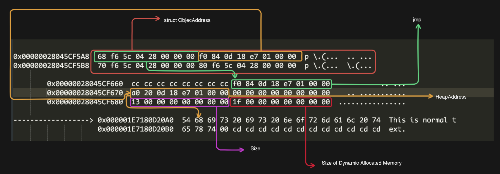

This blog is based on how memory allocation happens in the heap. I've tried to make it as simple as possible. While there are already many blogs available on this topic, most of them lack detail. In this blog, I've avoided using complex concepts and instead included more examples to help you gain intuition.

Before delving into the structure, let's write a simple code and debug it to understand how it works.

```cpp
#include <iostream>

int main()
{
    size_t val;
    int a;
    val = 0x19983;
    std::string strval = "This is normal text";
    std::string newstr{ "What about this string" };
    a = 1;
    std::cin >> a;
    std::cout << newstr << std::endl;
}
```

#### DEBUGGING

| Variable | Memory Location    |
| -------- | ------------------ |
| a        | 0x000000F36577F6F4 |

```cpp
0x000000F36577F6F4  01 00 00 00 cc cc cc cc cc cc cc cc cc cc cc cc  ....������������
0x000000F36577F704  cc cc cc cc cc cc cc cc cc cc cc cc cc cc cc cc  ����������������
0x000000F36577F714  cc cc cc cc cc cc cc cc cc cc cc cc cc cc cc cc  ������......����
0x000000F36577F724  cc cc cc cc cc cc cc cc cc cc cc cc cc cc cc cc  ����������������
```

---

| Variable | Memory Location    |
| -------- | ------------------ |
| val      | 0x000000F36577F6D8 |

```cpp
0x000000F36577F6D8  83 99 01 00 00 00 00 00 cc cc cc cc cc cc cc cc  ��......��������
0x000000F36577F6E8  cc cc cc cc cc cc cc cc cc cc cc cc 01 00 00 00  ������������....
0x000000F36577F6F8  cc cc cc cc cc cc cc cc cc cc cc cc cc cc cc cc  ����������������
0x000000F36577F708  cc cc cc cc cc cc cc cc cc cc cc cc cc cc cc cc  ����������������
0x000000F36577F718  cc cc cc cc cc cc cc cc cc cc cc cc cc cc cc cc  ��......��������
```

---

| Variable | Memory Location    |
| -------- | ------------------ |
| strval   | 0x000000F36577F758 |

```cpp
0x000000F36577F758  90 8a 5f 76 3f 02 00 00 20 2b 5f 76 3f 02 00 00 ��_v?... +_v?...
0x000000F36577F768  00 00 00 00 00 00 00 00 13 00 00 00 00 00 00 00  ................
0x000000F36577F778  1f 00 00 00 00 00 00 00
```

### Understanding String Objects

For 64-bit

- [0:8] : Unknown(stores the address)

- [8:16] : stringoffset

- [16:24] : Unknown

- [24:32] : Length

- [32:40] : capacity of dynamically allocated memory

[0:8] -> `0x0000023f765f8a90`

```cpp
0x0000023F765F8A90  58 f7 77 65 f3 00 00 00 00 00 00 00 00 00 00 00  X�we�...........
```

- The address(`0x00000000f36577f758`) holds the address from where we jumped (`0x0000023F765F8A90`).

[8:16] -> `0x0000023f765f2b20`

```cpp
0x0000023F765F2B20  54 68 69 73 20 69 73 20 6e 6f 72 6d 61 6c 20 74  This is normal t
0x0000023F765F2B30  65 78 74 00 cd cd cd cd cd cd cd cd cd cd cd cd  ext.������������
0x0000023F765F2B40  fd fd fd fd 6f 00 67 00 86 ed a3 02 6d 21 00 95  ����o.g.���.m!.�
```

- It holds the offset for the heap where the data is stored.

[16:24] -> `0x0000000000000000` (Unknown)

[24:32] -> `0x0000000000000013`

- It stores the length of the string data.

[32:40] -> `0x000000000000001f`

- capacity of dynamically allocated memory

## Let's try manipulating the object

We know that the `strval` object stores the offset and size. When we call the methods, it reads by moving to a particular offset. Let's increase the size of the payload and observe its behavior to gain insights into its internal workings.

- **Tweaked Object**

```cpp
0x000000F36577F758  90 8a 5f 76 3f 02 00 00 20 2b 5f 76 3f 02 00 00  ��_v?... +_v?...
0x000000F36577F768  00 00 00 00 00 00 00 00 00 13 00 00 00 00 00 00  ................
0x000000F36577F778  1f 00 00 00 00 00 00 00
```


- **Structure**

```cpp
struct StringObject {
    uint64_t* ret;
    uint64_t* stroffset;
    uint64_t* size;
};

struct ObjectAddress {
    uint64_t* pointer;
    StringObject ms;
};
```

## Crafting code for modifying the Object

```cpp
#include <iostream>

struct StringObject {
    uint64_t* jmp;
    uint64_t* stroffset;
    uint64_t* size;
};

struct ObjectAddress {
    uint64_t* pointer;
    StringObject ms;
};

uint64_t* __move__(uint64_t* offset, uint64_t lr) {
    return offset + lr;
}

int main()
{
    ObjectAddress mdata;
    ObjectAddress mandata;
    std::string* ptr;
    std::string* manptr;
    std::string strval = "This is normal text";
    std::string newstr = "Lily Bily Lily Bily Lily Bily Lily Bily !!!.";
    ptr = &strval;
    manptr = &newstr;
    mandata.pointer = reinterpret_cast<uint64_t*>(manptr);
    mandata.ms.jmp = (uint64_t*)(*(mandata.pointer));
    mandata.pointer = __move__(mandata.pointer, 0x01);
    mandata.ms.stroffset = (uint64_t*)((mandata.pointer));
    mandata.pointer = __move__(mandata.pointer, 0x02);
    mandata.ms.size = (uint64_t*)((mandata.pointer));
    mandata.pointer = __move__(mandata.pointer, -0x02);
    mandata.pointer = reinterpret_cast<uint64_t*>(manptr);
    *mandata.ms.size = 0x100;

    mdata.pointer = reinterpret_cast<uint64_t*>(ptr);
    mdata.ms.jmp = (uint64_t*)(*(mdata.pointer));
    mdata.pointer = __move__(mdata.pointer, 0x01);
    mdata.ms.stroffset = (uint64_t*)(mdata.pointer);
    mdata.pointer = __move__(mdata.pointer, 0x02);
    mdata.ms.size = (uint64_t*)(mdata.pointer);
    mdata.pointer = __move__(mdata.pointer, -0x02);
    mdata.pointer = reinterpret_cast<uint64_t*>(ptr);
    *mdata.ms.size = 0x100;
    std::cout << "StrVal :: " << strval.length() << std::endl;
    std::cout << "NewStr :: " << newstr.length() << std::endl;
    std::cout << "StrVal => " << strval << std::endl;
    std::cout << "\n\n\n" << std::endl;
    std::cout << "NewStr => " << newstr << std::endl;

}
```


**OverView**


### Swapping the content

```cpp
#include <iostream>

struct StringObject {
    uint64_t* jmp;
    uint64_t* stroffset;
    uint64_t* size;
};

struct ObjectAddress {
    uint64_t* pointer;
    StringObject ms;
};

uint64_t* __move__(uint64_t* offset, uint64_t lr) {
    return offset + lr;
}


int main()
{
    ObjectAddress mdata;
    ObjectAddress mandata;
    std::string* ptr;
    std::string* manptr;
    std::string strval = "This is normal text";
    std::string newstr = "Lily Bily Lily Bily Lily  Bily Lily Bily !!!....";
    ptr = &strval;
    manptr = &newstr;
    mandata.pointer = reinterpret_cast<uint64_t*>(manptr);
    mandata.ms.jmp = (uint64_t*)(*(mandata.pointer));
    mandata.pointer = __move__(mandata.pointer, 0x01);
    mandata.ms.stroffset = (uint64_t*)((mandata.pointer));
    mandata.pointer = __move__(mandata.pointer, 0x02);
    mandata.ms.size = (uint64_t*)((mandata.pointer));
    mandata.pointer = __move__(mandata.pointer, -0x02);
    mandata.pointer = reinterpret_cast<uint64_t*>(manptr);


    mdata.pointer = reinterpret_cast<uint64_t*>(ptr);
    mdata.ms.jmp = (uint64_t*)(*(mdata.pointer));
    mdata.pointer = __move__(mdata.pointer, 0x01);
    mdata.ms.stroffset = (uint64_t*)(mdata.pointer);
    mdata.pointer = __move__(mdata.pointer, 0x02);
    mdata.ms.size = (uint64_t*)(mdata.pointer);
    mdata.pointer = __move__(mdata.pointer, -0x02);
    mdata.pointer = reinterpret_cast<uint64_t*>(ptr);


    uint64_t t = *mandata.ms.stroffset;
    *mandata.ms.stroffset = *mdata.ms.stroffset;
    *mdata.ms.stroffset = t;
    t = *mandata.ms.size;
    *mandata.ms.size = *mdata.ms.size;
    *mdata.ms.size = t;

    std::cout << "StrVal => " << strval << std::endl;
    std::cout << "\n\n\n" << std::endl;
    std::cout << "NewStr => " << newstr << std::endl;
}
```


